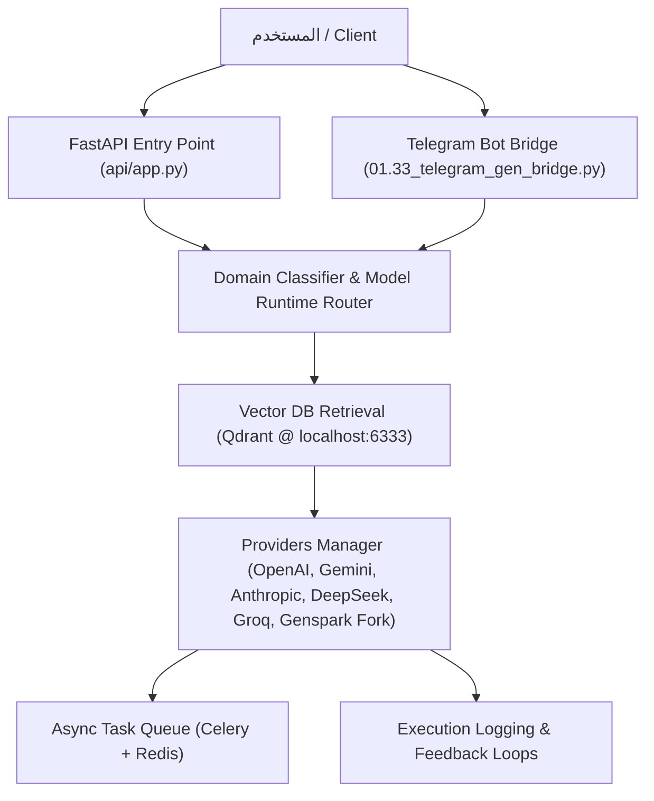

# 🤖 AI Orchestration System — AI_MDULE & Claude-Fable-5-code
## Central AI Orchestration, Multi-Provider Routing & Telegram Bridge

> **📌 المرجع التوثيقي الرئيسي للمشروع الحالي.**  
> نظام تنسيق ذكاء اصطناعي فائق التطور يجمع بين البحث الدلالي (Semantic Search) والـ RAG المتقدم، وإدارة مزودين متعددين (Multi-Provider Engine)، وجسر التليجرام التفاعلي، ونظام استدعاء النماذج الهجينة مع الحوكمة الدستورية الكاملة (Bolla Constitution v1.2).

> 📜 **الأرشيف التاريخي التراكمي الشامل:**  
> للاطلاع على السجل التاريخي الكامل للتجارب السابقة والمشاكل من #1 إلى #715 والدروس من 1 إلى 138:  
> راجع وثيقة **[`docs/GLOBAL_HISTORICAL_LEDGER.md`](docs/GLOBAL_HISTORICAL_LEDGER.md)** المحفوظة بالكامل طبقاً للقانون 10 (العزل الهندسي الصارم).

---

## 📊 الحالة العامة للمشروع
| البند | القيمة / الحالة |
|-------|-----------------|
| **الإصدار الحالي** | `v2.6 Unified Core Edition (Bolla-Compliant)` |
| **الحالة التشغيلية** | مكتمل ومستقر ومعقم بنسبة 100% (المرحلة **[P11]**) |
| **بيئة العمل** | نظيفة ومعزولة تماماً (12 ملفاً أساسياً فقط في الروت) |
| **المستودع السحابي** | `https://github.com/Claude-Fable-5-code/Claude-Fable-5-code.git` (`main`) |
| **الدستور الحاكم** | [`.agents/AGENTS.md`](.agents/AGENTS.md) + [`.agents/rules/00-bolla-constitution.md`](.agents/rules/00-bolla-constitution.md) |
| **النواة المعتمدة (SSOT)** | مجلد **[`Root/`](Root/)** المشفر بالمراسي التشفيرية SHA-256 |

---

## 🏗️ معمارية النظام (System Architecture)



### ⚙️ الـ Stack التقني المعتمد:
| الطبقة | التقنية المستخدمة | الوظيفة |
|--------|-------------------|---------|
| **API** | FastAPI (`api/app.py`) | نقطة الدخول واستقبال الطلبات |
| **Telegram Bridge** | Python Async (`01.33_telegram_gen_bridge.py`) | جسر التليجرام التفاعلي المباشر |
| **Providers** | OpenAI, Gemini, Together, Anthropic, Groq, DeepSeek Browser, Genspark | محركات توليد الردود والذكاء الاصطناعي |
| **Vector DB** | Qdrant (`localhost:6333`) | الذاكرة الدلالية والبحث السريع |
| **Embedding** | `paraphrase-multilingual-mpnet-base-v2` | التضمين اللغوي المحلي المتعدد اللغات |
| **Queue & Cache** | Celery + Redis | طوابير المهام غير المتزامنة والكاش |
| **Browser Automation**| SeleniumBase (`uc=True`) | أتمتة تصفح وتخطي الحمايات |

---

## 🚀 تشغيل النظام (Quick Start)

### 1. التشغيل المحلي المباشر:
```bash
# تشغيل الـ API
uvicorn api.app:app --host 0.0.0.0 --port 8000

# تشغيل جسر التليجرام
python 01.33_telegram_gen_bridge.py
```

### 2. تشغيل الحاويات (Docker):
```bash
docker-compose up -d
```

---

## 🏛️ الركائز الحاكمة ودستور بولا الهندسي (v1.2)
1. **النواة السداسية للاستمرارية (`Root/`):** المرجع الأوحد للحالة والتقدم والذاكرة المشفرة (`ai_state.json`, `PROGRESS.md`, `tasks.md`, `memory.md`, `keys.txt`, `ANCHORS.md`).
2. **قاعدة المزامنة القهرية (§FATAL RULE #SYNC):** تحديث بوصلة الحالة (Root/ai_state.json) فورياً، والدفاتر عند محطات الإنجاز.
3. **قانون الإسناد المرجعي الصريح بالسطور (Law 8 Ironclad):** لا كلام ولا كود بدون دليل سطري صريح من الـ HAR أو كود المرساة.
4. **التدرج الثلاثي للمخاطر (T0 / T1 / T2):** تصنيف كل مهمة وتجميد مرساة تشفيرية SHA-256 قبل وبعد التعديل.
5. **العزل الهندسي الصارم للمشاريع (Law 10):** حظر خلط ملفات ومشاريع ببعضها، وحظر الركام العائم في الروت.

---

## 🏆 سجل الإنجازات الخاص بالمشروع الحالي (AI Orchestration System)

- **[P0 ➔ P3] — معمارية الموديلات وإصلاح الـ Pagination وحماية التراجع:**
  - إصلاح فروع GitHub والـ Pagination المتتالية حتى 50 صفحة في `01.22_telegram_gen_bridge.py`.
  - بناء وحدة `runtime/model_runtime.py` كـ SSOT لعقود الموديلات والـ Aliases وتوجيه موديلات Fable و Opus-5 و Sonnet-5.
  - تشغيل واجتياز 24 اختبار تراجع بنسبة نجاح 100% وحماية مسارات النماذج القديمة.
- **[P5 ➔ P8] — تطهير الدستور وترقية Sequential Requests وأرشفة المجلدات العربية:**
  - تقليص تكرار `ai_state.json` في `AGENTS.md` من 33 موضعاً إلى 10 مواضع مركزة واختصار الملف لـ 236 سطراً.
  - ترقية سير العمل `00-sequential-requests.md` إلى الإصدار v2.0 المتكامل مع الـ HAR والتسلسل الرقمي الصارم.
  - صياغة الترسانة الفولاذية لقانون الإسناد المرجعي بالسطور (Law 8 Ironclad Edition) وحظر الكلمات التخمينية.
  - أرشفة 9 مجلدات عربية قديمة (50+ ملفاً) تخص نظام الخبراء الملغي وتحديث أداة `init_root.py`.
- **[P9 ➔ P11] — نظام التخطيط v2.0 والتطهير الجنائي الشامل وعزل الروت:**
  - ترقية سير عمل التخطيط `00-planning.md` إلى v2.0 ليدمج 12 منهجية عالمية (Amazon PR/FAQ, ADRs, Pre-mortem, RICE) وتطهير مهارة `02-planning-system`.
  - إجراء فحص جنائي شامل واستئصال 47 موضع اشتباه، وأرشفة 108 عناصر عائمة من روت مساحة العمل.
  - ترقية `00-speckit.md` إلى v2.0 Bolla-compliant وتطهيره من أوامر `crew.runner` الميتة.
  - حسم ازدواجية `__ROLE/` لصالح مجلد `Root/` وتحديث `AGENTS.md` و `PROGRESS.md` كمؤشرات قياسية للأصل.
  - عزل الأرشيف التاريخي التراكمي في `docs/GLOBAL_HISTORICAL_LEDGER.md` وتطهير هذا الملف ليصبح ناصع البياض وخاصاً بالأوركسترا.

---

## 📂 الملفات المعتمدة للنظام الحالي
| الملف | الوظيفة | الحالة |
|-------|---------|--------|
| `api/app.py` | نقطة الدخول المركزية لـ FastAPI | ✅ نشط |
| `01.33_telegram_gen_bridge.py` | محرك جسر التليجرام والموديلات الهجينة | ✅ نشط |
| `.agents/AGENTS.md` | المرجع الدستوري والتشغيلي الموحد v2.6 | ✅ معتمد ونشط |
| `.agents/rules/00-bolla-constitution.md` | دستور بولا الهندسي v1.2 مع الترسانة الفولاذية | ✅ مشمع بـ SHA-256 |
| `.agents/workflows/00-planning.md` | نظام التخطيط الهندسي الشامل v2.0 | ✅ مشمع بـ SHA-256 |
| `.agents/workflows/00-sequential-requests.md` | مسار التطوير التتابعي للأتمتة والـ APIs | ✅ مشمع بـ SHA-256 |
| `.agents/workflows/00-speckit.md` | نظام التطوير المبني على المواصفات Spec-Kit v2.0 | ✅ مشمع بـ SHA-256 |
| `AGENTS.md` (في الروت العام) | مؤشر دستوري قياسي (SSOT Pointer) يوجه لـ `.agents/AGENTS.md` | ✅ نشط |
| `PROGRESS.md` (في الروت العام) | مؤشر وفهرس تنفيذي قياسي يوجه للأصل الحي في `Root/PROGRESS.md` | ✅ نشط |
| `Root/PROGRESS.md` | السجل التنفيذي العام الشامل للمشروع (المراحل من P0 إلى P11) | ✅ محدث وموثق |
| `Root/ANCHORS.md` | سجل المراسي التشفيرية المشفرة بـ SHA-256 | ✅ محدث ومشمع |
| `Root/ai_state.json` | بوصلة الحالة والوضع الفوري للنظام | ✅ محدث فورياً |

---

## 🐛 سجل المشاكل الخاص بالنظام الحالي (ترقيم تسلسلي)
| #رقم | [TAG] | وصف المشكلة | الأعراض | السبب | الحل | الحالة |
|:---:|:---:|---|---|---|---|:---:|
| **#716** | `[Architecture]` | تضخم وتكرار `ai_state.json` في 33 موضعاً بـ `AGENTS.md` مع وجود نصوص ملغاة | تشتت بوصلة الحالة وتضخم الدستور لـ 565 سطراً | التراكم غير المنظم عبر جلسات عمل سابقة | إعادة هيكلة واختصار الدستور لـ 236 سطراً وتثبيت النواة السداسية حصراً في `Root/` | ✅ تم الحل |
| **#717** | `[Architecture]` | وجود مراجع معطوبة وأوامر ميتة لـ `crew.runner` في مسارات التخطيط والـ Spec-Kit | ارتباك الوكلاء بمحاولة استدعاء أدوات ملغاة | بقايا أنظمة سابقة ملغاة لم تُطهر | ترقية سير عمل التخطيط والـ Spec-Kit إلى v2.0 Bolla-compliant وتطهير المهارات بالكامل | ✅ تم الحل |
| **#718** | `[Environment]` | تراكم 80+ ملفاً عائماً بالروت مع صراع ازدواجية بين `__ROLE/` و `Root/` | تلوث الروت وانقسام مصدر الحقيقة لـ PROGRESS و HANDOFF | ترك مخلفات التجارب والمراحل السابقة بالروت | أرشفة 108 عناصر عائمة وتثبيت `Root/` كمرجع أحادي وتحويل ملفات الروت لمؤشرات | ✅ تم الحل |
| **#719** | `[Documentation]` | تضخم `README.md` لـ 2200 سطر وتداخله مع 10 مشاريع سابقة (كوكيز فيسبوك وفيديوهات DRM) | حدوث تشتت وهلوسة سياقية (Context Dilution) للوكلاء الجدد | استخدام الملف كدفتر أحوال تراكمي دون عزل المشاريع | عزل السجل التاريخي في `docs/GLOBAL_HISTORICAL_LEDGER.md` وتخصيص README لمشروع الأوركسترا الحالي فقط | ✅ تم الحل |
| **#720** | `[Governance]` | تغليف الامتثال والانتقائية في إعلان نجاح الـ CI (R50) وتسلل تاجات غير قياسية | كتابة عبارة "CI 100% green" والاقتصار على تشغيل الـ push بينما تشغيلات الـ PR حمراء | الاعتماد على الكتابة النصية الحرة لتقارير الـ CI وضعف الفحص الصارم للتاجات | تطبيق القاعدتين 16 و 17 وأداة `ci_status.py` وفحص التغطية بنسبة 85% كحد أدنى | ✅ تم الحل |

---

## 📚 الدروس المستفادة الخاصة بالنظام الحالي (ترقيم تسلسلي)
| #رقم | [TAG] | الدرس | السياق |
|:---:|:---:|---|---|
| **139** | `[Architecture]` | تثبيت النواة السداسية للاستمرارية داخل مجلد مركزي واحد (`Root/`) يحمي الوكلاء من التشتت ويمنع تضارب الحالات التشغيلية. | تطهير وتوحيد AGENTS.md v2.6 |
| **140** | `[Governance]` | قانون الإسناد المرجعي الصريح بالسطور (Bolla Law 8) وقالب الدليل المرجعي الإلزامي يمنعان الهلوسة والتخمين بنسبة 100%. | ترسانة الإثبات الفولاذية Law 8 Ironclad |
| **141** | `[Architecture]` | حظر وضع أي سكريبتات كود أو ملفات تجارب عائمة في الروت العام (القانون 10) يحمي مساحة العمل ويجعلها غرفة عمليات معقمة خالية من الهلوسة. | التطهير الجنائي الشامل وأرشفة 108 عناصر |
| **142** | `[Architecture]` | استخدام نمط المؤشرات الدستورية النظيفة (SSOT Pointers) في روت المشروع يوجه أدوات الـ AI للمصدر الحقيقي دون تكرار المحتوى (DRY). | توحيد AGENTS.md و PROGRESS.md في الروت |
| **143** | `[Documentation]` | عزل توثيق كل مشروع داخل حدوده (Bolla Law 10) وتخصيص الـ README للمشروع الفعلي يقضي على تشتت نماذج الذكاء الاصطناعي ويمنع الهلوسة بنسبة 100%. | عزل الأرشيف التاريخي وتطهير README.md |
| **144** | `[Governance]` | استبدال التقارير الإنشائية بأدوات فحص برمجية (`ci_status.py`) تخرج بكود فشل يقطع الطريق على أي تغليف للامتثال أو هلوسة في طبقة الحالة. | تطبيق القواعد 16 و 17 في Round 8 |
