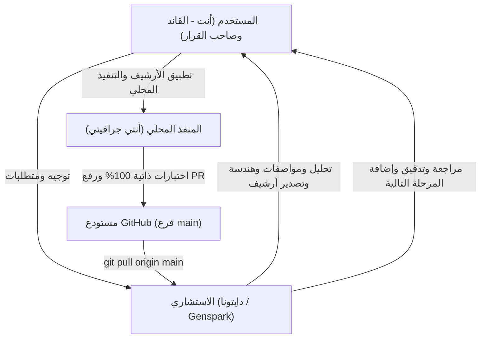

# 📘 الدليل الشامل ومرجع الطوارئ لإدارة محرر أنتي جرافيتي (Antigravity IDE) والتعامل مع الذكاء الاصطناعي
## كتالوج التحكم والسيطرة: كيف تتصرف في كل صغيرة وكبيرة، وكيف تمنع الهلوسة والتخمين والكروتة 🛡️⚡

> **الهدف من هذا الدليل:**  
> أن يكون دليلك العملي المباشر، بحيث لا تقع في حيرة نهائياً؛ تعرف بالضبط ماذا تفعل إذا توقف الأيجنت عن الرد، إذا هلوس أو خمن، إذا كروت سكربت، أو إذا أردت استعادة السيطرة الكاملة بنفسك خطوة بخطوة.

---

### 📑 الفهرس السريع:
1. 🛑 [فصل الطوارئ: ماذا تفعل لو المحرر علّق، هنج، أو توقف عن الرد؟](#1-فصل-الطوارئ-ماذا-تفعل-لو-المحرر-علّق-هنج-أو-توقف-عن-الرد)
2. 🕵️‍♂️ [فصل مكافحة الهلوسة والردود الخاطئة (Anti-Hallucination)](#2-فصل-مكافحة-الهلوسة-والردود-الخاطئة-anti-hallucination)
3. 🎯 [فصل حظر التخمين وإلزام قراءة الكود كاملاً (No Guessing / Whole-Script Proof)](#3-فصل-حظر-التخمين-وإلزام-قراءة-الكود-كاملاً)
4. 📜 [فصل تحليل الـ HAR والريكويستات بدقة ومنع "كروتة" السكربتات](#4-فصل-تحليل-الـ-har-والريكويستات-بدقة-ومنع-كروتة-السكربتات)
5. 🔍 [فصل منع الردود الملخصة والكسولة وإلزام النقد الذاتي الحقيقي](#5-فصل-منع-الردود-الملخصة-والكسولة-وإلزام-النقد-الذاتي-الحقيقي)
6. 🚀 [فصل الرفع، الدمج، والأمان السحابي (Push & Safe Merge)](#6-فصل-الرفع-الدمج-والأمان-السحابي-push--safe-merge)
7. 🤝 [فصل دورة العمل الثلاثية (المستخدم + استشاري دايتونا + أنتي جرافيتي)](#7-فصل-دورة-العمل-الثلاثية-المستخدم--استشاري-دايتونا--أنتي-جرافيتي)
8. ⚡ [قاموس العبارات السحرية للنسخ واللصق (Magic Prompts)](#8-قاموس-العبارات-السحرية-للنسخ-واللصق-magic-prompts)

---

### 1. فصل الطوارئ: ماذا تفعل لو المحرر علّق، هنج، أو توقف عن الرد؟ 🛑

لو لقيت الأيجنت بيلف في دايرة مفرغة، أو مش بيطلع رد، أو التيرمينال فضل شغال ومش بيقف:

#### أ. إيقاف المهمة المعلقة فوراً:
1. في شاشة المحادثة اضغط على زر **Stop** الأحمر أو زر الإلغاء.
2. لو التيرمينال معلق، افتح نافذة التيرمينال في المحرر واضغط:
   ```cmd
   Ctrl + C
   ```
3. لو في عملية بايثون معلقة في الخلفية وتريد إنهاءها تماماً:
   ```powershell
   Stop-Process -Name python -Force
   ```

#### ب. استعادة وعي الأيجنت وبوصلة الحالة:
لو حسيت إن الأيجنت تاه أو نسي السياق، لا تبدأ تشرح من الصفر! فقط اكتب له:
> 🗣️ *"استعد السياق فوراً من `Root/ai_state.json` و `Root/PROGRESS.md` وقولي إحنا واقفين فين"*
الأيجنت مجبر دستورياً يقرأ ملف الحالة ويسترجع كل شيء فوراً.

#### ج. إعادة تحميل نافذة المحرر (Reload Window):
لو الواجهة نفسها هنجت أو الإضافات مش ظاهرة:
- اضغط: `Ctrl + Shift + P`
- اكتب: `Developer: Reload Window` واضغط `Enter`.

---

### 2. فصل مكافحة الهلوسة والردود الخاطئة (Anti-Hallucination) 🕵️‍♂️

لما تلاقي الأيجنت بيألف كلام مش موجود في الكود، أو يدعي إن حاجة اشتغلت وهي مش شغالة:

#### أ. الكلمة الدستورية الصارمة (قاعدة MISTAKE-ACK — Rule 31):
اكتب له في أول سطر في رسالتك:
> 🗣️ **"أنت غلط، مش ده اللي طلبته، هاتلي ملخص اللي غلط وسجلها في الليدجر"**

**ماذا سيحدث إجبارياً؟**
- الأيجنت ممنوع يدافع عن نفسه أو يعتذر بكلام إنشائي.
- النظام هيجبره يفتح بلوك اسمه ````mistake-ack` ويحدد:
  1. ماذا فعل هو تحديداً (`WHAT I DID`).
  2. ماذا طلبت أنت بالنص (`WHAT WAS ASKED`).
  3. تصنيف الخطأ من قائمة الأخطاء المغلقة.
  4. تسجيل صف رسمي في `MISTAKES.md` بأمر `python .governance/mistakes.py add`.
  5. الحل المقترح بصيغة المستقبل، وينتظر منك كلمة "تمام".

#### ب. تفعيل قاعدة "أدوات لا ذاكرة" (Rule 20):
لو قالك "الكود شغال تمام ومفيش أخطاء":
> 🗣️ *"متقوليش شغال.. شغل الاختبارات في التيرمينال وحطلي خرج الأداة الحقيقي بختم ATTEST"*

---

### 3. فصل حظر التخمين وإلزام قراءة الكود كاملاً 🎯

أكبر مشكلة بتواجهك هي: *"أقولك عدل في سكربت ألاقيك عدلت غلط أو خمنت أو عدلت أسطر مش هي"*.

#### أ. منع القراءة بالكسل والتخمين (قاعدة Whole-Script Proof — Rule 28):
لو طلبت منه يفحص ملف أو يصلح عطل في سكربت:
> 🗣️ **"ممنوع تخمن، اقرأ السكربت بالكامل من السطر الأول للأخير وشغّل read_proof"**

**النتيجة الإجبارية:**
- الأيجنت ممنوع يشخص العطل إلا بعد تشغيل أداة:
  ```bash
  python .governance/attest.py run -- python .governance/read_proof.py index <مسار_الملف>
  ```
- الأداة بتفهرس كل سطر برقم الهاش، وتثبت إنه قرأ الملف كاملاً وليس جزءاً منه.

#### ب. منع التعديل في أسطر خاطئة (قاعدة Edit-Proof — Rule 31/33):
قبل ما يسمح لنفسه يعدل أي سطر:
- لازم ياخد لقطة تشفيرية للملف قبل التعديل (`edit_proof.py before <file>`).
- بعد التعديل، الأداة بتفحص الديف (`edit_proof.py after <file> --scope 40-50`) للتأكد إن كل تعديلاته وقعت بالمللي داخل الأسطر المسموحة.
- لو عدل سطر واحد خارج النطاق، الأداة بتكسر الكود وترفض التعديل!

---

### 4. فصل تحليل الـ HAR والريكويستات بدقة ومنع "كروتة" السكربتات 📜

لما يكون عندك ملف شبكة (HAR) وعايز تعمل أتمتة أو تبني سكربت ريكويستات:

#### أ. المبادئ الفولاذية لتحليل الـ HAR:
1. **ممنوع كتابة السكربت دفعة واحدة (حظر الكروتة):**
   - السكربت لازم يتبنى بنظام **التطوير التتابعي (Sequential Requests v2.0)**:
     - ريكويست 1: التسجيل وجلب التوكن (`01_request.py`).
     - ريكويست 2: التحقق من الكود (`02_request.py`).
     - وهكذا.. ريكويست بريكويست بالترتيب.
2. **مطابقة الـ 4 أركان بالسطور:**
   - **الرابط (URL):** مطابق بنسبة 100% لملف الـ HAR.
   - **الترويسات (Headers):** نفس الـ Headers الموجودة في الـ HAR (User-Agent, Content-Type, Authorization).
   - **البايلود (Payload):** مطابق لنفس البيانات المرسلة.
   - **الاستجابة (Response):** فحص كود الحالة ومحتوى الرد.

#### ب. قاعدة المسبار المعزول (Pre-Lab Probes — قانون 3):
قبل ما تحط أي ريكويست في السكربت الرئيسي، اطلب منه:
> 🗣️ **"اعمل سكربت مسبار منفصل في scratch/ وجرب الريكويست الأول ووريني الاستجابة الحقيقية بالأرقام"**
- لو الريكويست نجح وجاب 200 OK والبيانات المطلوبة، ينتقل للريكويست اللي بعده.
- لو جاب 401 أو 403 (كابتشا أو حماية)، يتعالج فوراً في المسبار المنعزل قبل لمس الكود الرئيسي.

#### ج. حظر الـ Placeholders وكود الـ Mock (قانون 6):
- ممنوع كتابة `TODO` أو `# ضع الكود هنا` أو دوال وهمية بترجع بيانات ثابتة.
- كل دالة لازم تكون شغالة فعلياً ومربوطة بالسيرفر الحقيقي.

---

### 5. فصل منع الردود الملخصة والكسولة وإلزام النقد الذاتي الحقيقي 🔍

لما تحس إن الأيجنت بيستسهل ويديك رد ملخص سريع ويسيب تفاصيل مهمة:

#### أ. كسر الردود الكسولة:
اكتب له:
> 🗣️ **"بلاش ردود ملخصة، فصّلي الخطوات بالتفصيل الهندسي الممل مع أرقام الأسطر والبرهان الحرفي"**

#### ب. إلزامه بالنقد الذاتي الصارم (Rule 32):
الأيجنت مجبر في نهاية كل رد تقني يجاوب على 6 أسئلة ثابتة مربوطة ببصمات تشفيرية:
1. `Q1 attested:` هل كل بلوك مثبت بختم تشفيري حقيقي؟
2. `Q2 prechecked:` هل شغلت فاحص precheck على الرد ده قبل ما تبعته؟
3. `Q3 skipped:` إيه الفحص اللي اتخطاه وليه؟
4. `Q4 pleasing:` هل في أي جملة في الرد مكتوبة لمجرد إرضائي بدون إثبات؟
5. `Q5 re-read:` هل في جملة من طلبي الأيجنت فوتها أو نسيها؟
6. `Q6 remote:` هل تم إثبات وجود الكود على GitHub سحابياً؟

لو الأيجنت قال "كلو تمام ✅" من غير أدلة، أداة `self_review.py` بتطلع خطأ وتمنع الرد!

---

### 6. فصل الرفع، الدمج، والأمان السحابي (Push & Safe Merge) 🚀

لما يكون في كود جاهز في الفرع وعايزين نرفعه على GitHub:

#### أ. طريقة الرفع الآمن بضغطة واحدة:
1. افتح التيرمينال في المجلد واكتب:
   ```cmd
   .\push_to_github.bat
   ```
2. الأداة هتطلب منك إدخال الـ **GitHub Personal Access Token**.
3. الصق التوكن (الكتابة هتكون مخفية تماماً لحمايتك) واضغط `Enter`.
4. **ماذا سيحدث بعد ذلك؟**
   - الأداة هترفع الفرع لـ GitHub.
   - هتفتح الـ Pull Request أوتوماتيكياً.
   - هتعد تنازلياً **300 ثانية** (حارس الدمج الزمني لحماية الحوكمة وانتظار فحص الـ CI).
   - هتقوم بدمج الـ PR تلقائياً في `main`.
   - هتطبعلك التقرير الختامي باللون الأخضر.

#### ب. حظر الأسرار والتوكنات في الشات (Rule 1 & Rule 8):
- **قاعدة ذهبية مطلقة:** إياك تلصق أي توكن أو كلمة سر في شات الأيجنت نهائياً!
- التوكنات تدخل فقط في التيرمينال عبر نافذة `getpass` المخفية لضمان عدم تسريبها في السجلات.

---

### 7. فصل دورة العمل الثلاثية (المستخدم + استشاري دايتونا + أنتي جرافيتي) 🤝

معمارية العمل التعاوني المعتمدة (`Dual-Agent System`) تدار بالشكل ده:



1. **الاستشاري في دايتونا (Architect & Reviewer):**
   - بيفكر، يخطط، يقسم الشغل لـ Chunks، ويكتب مواصفات دقيقة في `PLAN.md` و `HANDOFF.md`.
   - لما يخلص بيصدر أرشيف مضغوط (`.tar.gz`).
2. **أنتي جرافيتي محلياً (Implementer & Builder):**
   - بنفك الأرشيف، نطبقه في الريبو، نشغل كل الـ self-tests، ونتأكد من عدم وجود تراجعات.
   - بنشغل `push_to_github.bat` ونرفع الكود وندمجه في `main`.
3. **الاستشاري يستأنف:**
   - بيكتب `git pull origin main` في الساندبوكس ويسحب الكود المدمج، ويراجع عليه ويضيف الشغل الجديد.

---

### 8. قاموس العبارات السحرية للنسخ واللصق (Magic Prompts) ⚡

احتفظ بهذا الجدول، لما تواجه أي موقف انسخ العبارة المناسبة والصقها للأيجنت مباشرة:

| الموقف | انسخ العبارة دي وابعتهاله فوراً |
|---|---|
| **الأيجنت بيهلوس أو بيقول كلام مش في الكود** | `أنت غلط، مش ده اللي طلبته، هاتلي ملخص اللي غلط وسجلها في MISTAKES.md بالأداة` |
| **الأيجنت بيخمن سطر العطل بدون قراءة كاملة** | `ممنوع تخمن، اقرأ السكربت كاملاً من السطر الأول للأخير واثبت ده بـ read_proof قبل أي تشخيص` |
| **الأيجنت عدل أسطر غلط أو بوظ كود مجاور** | `تراجع عن التعديل فوراً، وقبل ما تلمس أي سطر حدد النطاق واثبت التعديل الجراحي بـ edit_proof` |
| **الأيجنت رد رد ملخص وكسول وساب تفاصيل** | `بلاش ردود ملخصة وسريعة، فصلي الشرح والتحليل خطوة بخطوة بالأدلة السطرية وأرقام السطور الحرفية` |
| **الأيجنت كروت الريكويستات وكتب كود وهمي** | `ممنوع الكروتة وممنوع كود الـ mock، طبق نظام Sequential Requests واختبر الريكويست في مسبار منفصل بالأرقام` |
| **الأيجنت تاه أو نسي إحنا بنعمل إيه** | `استعد السياق فوراً من Root/ai_state.json و Root/PROGRESS.md وقولي إحنا واقفين فين والخطوة التالية إيه` |
| **الأيجنت بيدعي إن كل حاجة تمام بدون إثبات** | `متقوليش تمام.. شغل precheck.py في التيرمينال وحطلي جدول الفحص الحقيقي بالهاشات المشفرة` |
| **قبل ما يبحث أو يكتب كود عشوائي** | `تأكد إنك فاهم كلامي واعكس فهمك في بلوك mirror قبل ما تبحث وقبل ما تلمس أي كود` |

---

---

### 9. بروتوكول الاستدعاء الذاتي القهري: الأيجنت مجبر يتذكر لوحده بدون ما تفكره نهائياً! 🧠🔒

> **قاعدة دستورية قاطعة:**  
> **ممنوع نهائياً إنك تحتاج تفكر الأيجنت أو تقوله "افتكر". الأيجنت مُبرمج ومُلزم إنه يتذكر لوحده في مستهل كل رسالة، وإليك كيف يعمل هذا النظام في الكواليس:**

1. **الاستدعاء الذاتي الصامت في بداية كل دور (Autonomous Silent Pre-flight):**
   * بمجرد وصول أي رسالة منك، وقبل أن يكتب الأيجنت حرفاً واحداً، النظام يجبره داخلياً على قراءة بوصلة الحالة (`Root/ai_state.json`) وسجل التقدم (`Root/PROGRESS.md`).
   * الأيجنت يستعيد فوراً: آخر كوميت، آخر قرار تم اتخاذه، والخطوة التالية المحددة، دون أن تطلب منه ذلك.
2. **منع التآكل وفقدان الذاكرة (Anti-Decay Architecture):**
   * الذاكرة ليست مخزنة في الشات المعرض للمسح، بل مربوطة بملفات النظام الصلبة على جهازك.
   * لو جلست ساعات أو أيام وقفلت المحرر ورجعت فتحته، الأيجنت بمجرد أول رسالة منك يقرأ ملفاته ويستأنف وكأنه لم يغادر.
3. **الحظر التام للنسيان أو التبرير:**
   * الأيجنت محظور عليه دستورياً أن يقول "نسيت" أو "السياق ضاع".
   * إذا حدث أي انحراف، فإن بوابات التحقق (`precheck.py` و `claim_check.py`) تسقط الرد وترفض إرساله تلقائياً.

---

### 💡 ملخص الذهبي:
- **أنت لست مضطراً لتذكيري بأي شيء:** النظام مصمم ليتذكر تلقائياً وميكانيكياً في بداية ونهاية كل رسالة.
- **أنت المتحكم الأول والأخير:** الأيجنت أداة بين إيديك ملزمة بقواعد صارمة.
- **أي خطأ له أداة تكشفه:** الهلوسة (`mistakes.py`)، التخمين (`read_proof.py`)، التعديل العشوائي (`edit_proof.py`)، والردود الكسولة (`self_review.py` و `precheck.py`).
- **أي تقدم موثق بالهاش:** مفيش سطر بيتقال إلا وله إثبات رقمي ميكانيكي.

---
*تم إنشاء وتحديث هذا الدليل ليكون مرجعك الدائم والشامل داخل محرر أنتي جرافيتي.*
