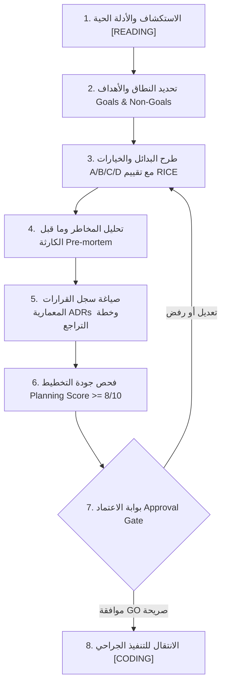

# 📐 UNIFIED PLANNING ENGINE v2.0 — نظام التخطيط الهندسي الشامل
## Universal • Rigorous • Battle-Tested • Bolla-Compliant (v1.2)
> **المسار:** `.agents/workflows/00-planning.md`
> **التكامل الدستوري:** متوافق 100% مع دستور بولا الهندسي v1.2 (`.agents/rules/00-bolla-constitution.md`) و النواة الموحدة (`.agents/AGENTS.md`)
> **المهارة التنفيذية المعتمدة:** `.agents/skills/02-planning-system/SKILL.md`

---

## 🔬 المنهجيات الهندسية الـ 12 العالمية المتكاملة

| # | المنهجية العالمية | المصدر الهندسي | القيمة المضافة والتكامل مع دستور بولا |
|---|-------------------|----------------|----------------------------------------|
| 1 | **Amazon Working Backwards (PR/FAQ)** | Amazon Product Dev | صياغة الهدف من وجهة نظر المستفيد النهائي والإجابة على أصعب الأسئلة قبل كتابة سطر كود واحد. |
| 2 | **Goals + Non-Goals** | Couchbase / Uber RFC | ترسيم حدود النطاق بصرامة وعزل الأبعاد المستبعدة عمداً لمنع الـ Scope Creep (القانون 2 و 10). |
| 3 | **Key Metrics & Open Questions** | Google Design Docs | وضع مؤشرات كمية محايدة لقياس النجاح وحصر الأسئلة المفتوحة وتعيين مسؤولياتها. |
| 4 | **RICE Scoring + Capacity** | Intercom | ترتيب الأولويات والبدائل بمعادلة موضوعية: `(Reach × Impact × Confidence) ÷ Effort`. |
| 5 | **Architecture Decision Records (ADR)** | GitHub MADR 4.0 | توثيق القرارات المعمارية بدورة حياة واضحة (Proposed, Accepted, Superseded) مع توثيق الأثر والبدائل. |
| 6 | **Pre-mortem Analysis** | Gary Klein / Atlassian | افتراض وقوع الكارثة مسبقاً وتحديد نقاط الضعف ووضع تدابير وقائية قبل بدء العمليات الحية. |
| 7 | **RFC 2119 Precision Keywords** | IETF / Amazon AWS SOPs | دقة التوصيف اللغوي الصارم باستخدام المصطلحات الدستورية: `MUST`, `MUST NOT`, `SHOULD`, `MAY`. |
| 8 | **Adaptive Context & Memory Core** | Bolla Unified Core | مزامنة بوصلة الحالة واستعادة السياق التشغيلي فوراً من `Root/ai_state.json` ودفاتر النواة الموحدة. |
| 9 | **Reversibility & Rollback Plan** | Bezos Type 1/Type 2 Decisions | تصنيف القرارات المعمارية القابلة للتراجع وتوفير خطة تراجع فورية مدعومة بالمراسي التشفيرية (القانون 1). |
| 10 | **Shape Up Appetite & Timeboxing** | Basecamp | تحديد سقف الجهد والوقت المتاح للحل الهندسي بدلاً من استنزاف الموارد في تحسينات غير مطلوبة. |
| 11 | **Risk Classifier (T0 / T1 / T2 Gates)** | Bolla Constitution (Law 1 & 4) | تصنيف المخاطر المسبق: 🟢 T0 وثائقي، 🟡 T1 جراحي محدود، 🔴 T2 معماري/شبكي/ملف جديد يتطلب مواصفات كاملة. |
| 12 | **Bolla Spec-Kit & Handoff Bridge** | Bolla Constitution (Law 9) | إصدار وثيقة مواصفات ما قبل التعديل المعتمدة (Pre-edit Spec) وكوبري الاستئناف والتسليم `HANDOFF.md`. |

---

## 🏛️ القوانين الدستورية الحاكمة للتخطيط (Bolla Ironclad Rules)

### ⛔ 1. حظر الكود التنفيذي أثناء التخطيط (Zero-Code in Planning Mode)
* في وضع التخطيط `[PLANNING]`، **يُمنع منعاً باتاً كتابة أو تعديل أي سطر في كود التشغيل الفعلي**.
* دور التخطيط هو البحث، التحليل، المقارنة، صياغة المواصفات، وتحديد المخاطر.
* الانتقال للتنفيذ يتطلب استيفاء بوابة الاعتماد (Approval Gate) وموافقة المستخدم الصريحة.

### 📜 2. قانون الإسناد المرجعي الصريح بالسطور (Verbatim Ground-Truth Citation)
* يُحظر بناء أي خطة أو افتراض معماري على التخمين أو عبارات "المفروض كذا" أو "أعتقد".
* كل قرار تقني أو تعديل في مسار أو مكتبة يجب أن يستند إلى دليل سطري صريح من:
  1. ملفات الـ HAR الحية للشبكة.
  2. كود المرساة القائم برقم السطر الدقيق (`.anchor`).
  3. مخرجات المسبار الخارجي المحايد (Pre-Lab Probes).
  4. التوثيق الرسمي المعتمد للإصدار المستخدم.

### 🔴 3. تصنيف المخاطر وتثبيت المراسي (Risk Classifier & Anchors)
* **🟢 المستوى T0 (منخفض):** تحديث توثيق، قوالب، نصوص واجهة ثابتة $\rightarrow$ تعديل مباشر مع حفظ الحالة.
* **🟡 المستوى T1 (متوسط):** تعديل جراحي محدود ($\le 10$ أسطر diff) $\rightarrow$ أخذ مرساة `.anchor` وتسجيل SHA-256 في `Root/ANCHORS.md`.
* **🔴 المستوى T2 (عالي/حرج):** تغيير معماري، تعديل بروتوكول شبكة، تغيير تخزين، أو إنشاء ملف كود تنفيذي جديد $\rightarrow$ بروتوكول T2 الإلزامي:
  1. وثيقة مواصفات كاملة (Pre-edit Spec).
  2. محاكاة جافة ومسبار خارجي مستقل (Dry Run / Pre-Lab).
  3. خطة تراجع واضحة وموثقة.
  4. موافقة صريحة "GO" من المستخدم قبل التنفيذ.

---

## ⚡ بروتوكول التخطيط خطوة بخطوة (Step-by-Step Planning Workflow)

---

### 1️⃣ الخطوة الأولى: الاستكشاف والفحص الحي (`[READING]` / `[RESEARCH]`)
* قراءة الملفات القائمة واستيعاب الـ Architecture الفعلي بدقة.
* جمع الأدلة الحرفية بالسطور وتثبيت حالة البداية في `Root/ai_state.json`.
* التحقق من عدم وجود ديون تقنية أو تعديلات معلقة في `Root/tasks.md` و `Root/memory.md`.

### 2️⃣ الخطوة الثانية: اختيار القالب وتحديد النطاق (Scope Definition)
* اختيار القالب الأنسب لطبيعة المهمة من المهارة الرسمية `.agents/skills/02-planning-system/SKILL.md`:
  1. **قالب 1:** بوت / سكريبت تلقائي (Bot & Automation).
  2. **قالب 2:** موقع ويب / تطبيق واجهة (Web App / Frontend).
  3. **قالب 3:** خدمة خلفية أو واجهة برمجية (API / Backend Service).
  4. **قالب 4:** تكامل مع مزود ذكاء اصطناعي (AI Provider Integration).
  5. **قالب 5:** نظام متكامل شامل (Full Stack Architecture).
* صياغة الأهداف الصريحة (**Goals**) والأبعاد المستبعدة عمداً لمنع التشتت (**Non-Goals**).

### 3️⃣ الخطوة الثالثة: طرح البدائل وخيارات الحل (Options A/B/C/D)
* عند وجود قرار تقني متعدد الطرق، يتم عرض الخيارات بنمط موضوعي موحد:
  * **الخيار (A):** الحل المباشر / الأدنى تغييراً (Minimal Surgical).
  * **الخيار (B):** الحل المعماري الشامل (Robust Architectural).
  * **الخيار (C):** الحل السريع / المؤقت (Quick Workaround - مع ذكر الديون التقنية).
  * **الخيار (D) 🌟:** المقترح المهني الموصى به (Recommended Best-fit) الذي يجمع بين الصلابة، الأمان، وسهولة الصيانة.
* حساب مؤشر **RICE Score** لكل خيار لمفاضلة علمية محايدة:
  $$\text{RICE} = \frac{\text{Reach} \times \text{Impact} \times \text{Confidence}}{\text{Effort}}$$

### 4️⃣ الخطوة الرابعة: فحص ما قبل الكارثة ومصفوفة المخاطر (Pre-mortem & Risk Matrix)
* تطبيق تقنية **Pre-mortem**: "تخيل أن النظام انهار بالكامل بعد النشر بـ 48 ساعة — ما هي الأسباب المحتملة؟"
* وضع خطة وقائية مسبقة لكل سبب محتمل.
* بناء مصفوفة المخاطر (الاحتمالية $\times$ الأثر) وتصنيف الخطر العام (🟢 منخفض / 🟡 متوسط / 🔴 حرج).

### 5️⃣ الخطوة الخامسة: القرارات المعمارية وخطة التراجع (ADRs & Rollback Plan)
* صياغة كل قرار وفق هيكل **MADR 4.0**:
  * **السياق والمشكلة (Context):** ما الدافع وراء هذا القرار برقم السطر والدليل؟
  * **القرار المعتمد (Decision):** ماذا سنفعل بالتحديد باستخدام مصطلحات RFC 2119 (`MUST`, `SHOULD`)؟
  * **العواقب (Consequences):** الإيجابيات، السلبيات المحتملة، والديون التقنية.
  * **خطة التراجع (Rollback Plan):** كيف نعود للحالة السابقة في ثوانٍ إذا فشل التعديل؟ (باستخدام المرساة `.anchor`).

### 6️⃣ الخطوة السادسة: مراجعة الجودة وإصدار الوثيقة (Planning Quality Gate)
* فحص الخطة أمام **بطاقة الجودة العشرية** (يجب تحقيق $\ge 8/10$ قبل طلب الموافقة):
  1. [ ] الهدف محدد وقابل للقياس بمؤشرات واضحة (Metrics).
  2. [ ] الـ Non-Goals محددة وتمنع التشتت.
  3. [ ] كل قرار مستند لدليل سطري من المرجع الأساسي (Verbatim Citation).
  4. [ ] البدائل A/B/C/D مقيمة بمؤشر RICE.
  5. [ ] فحص الـ Pre-mortem أجرى وخطة الوقاية مكتوبة.
  6. [ ] مستوى المخاطر T0/T1/T2 مصنف بوضوح.
  7. [ ] خطة التراجع السريع (Rollback Plan) محددة بالمرساة.
  8. [ ] المهام مجزأة لوحدات ميكرو صغيرة قابلة للاختبار المستقل (`00-micro-tasking.md`).
  9. [ ] لا يوجد أي تكرار أو تناقض مع دستور بولا أو القواعد السابقة.
  10. [ ] الذاكرة ونواة الاستمرارية (`Root/ai_state.json`) محدثة بالكامل.
* توليد أو تحديث وثيقة المواصفات الفنية `implementation_plan.md` ومشاركتها مع المستخدم.

### 7️⃣ الخطوة السابعة: بوابة الاعتماد الصريحة (Approval Gate)
* **توقف إلزامي:** التوقف التام وانتظار إشارة "GO" أو موافقة صريحة من المستخدم.
* بعد الموافقة: الانتقال إلى وضع التنفيذ `[CODING]` مع تثبيت التاج والمهمة في النواة الموحدة.

---

## 🛑 محظورات التخطيط القاتلة (Fatal Anti-Patterns)

| # | المحظور القاتل | السبب الهندسي والعقوبة الدستورية |
|---|----------------|----------------------------------|
| 💀 1 | البدء في كتابة أو تعديل كود أثناء التخطيط | انتهاك صريح للقانون 4 و 6 (عزل الصلاحيات) $\rightarrow$ إلغاء التعديل فوراً. |
| 💀 2 | التخطيط المبني على التخمين بدون أدلة سطرية | انتهاك للقانون 8 (الإسناد المرجعي) $\rightarrow$ رفض الخطة واعتبارها باطلة. |
| 💀 3 | تجاهل خطة التراجع (Rollback Plan) | انتهاك للقانون 1 و 9 $\rightarrow$ حظر تنفيذ المهمة حتى توفير خطة تراجع مدعومة بالمرساة. |
| 💀 4 | التخطيط المفتوح بلا حدود (Scope Creep) | انتهاك للقانون 2 و 10 $\rightarrow$ إلزامية تحديد Non-Goals واضحة قبل البدء. |
| 💀 5 | عدم تحديث دفاتر النواة الموحدة أثناء التخطيط | انتهاك لـ Fatal Rule #SYNC $\rightarrow$ توقف فوري وتحديث `Root/ai_state.json`. |

---

## 🔗 التكامل المباشر مع الأدوات والمهارات

* **سجلات وقوالب التخطيط:** استخدم المهارة الرسمية [02-planning-system](file:///d:/SMS/.hRhRhRhRhRhR/.agents/skills/02-planning-system/SKILL.md) لتطبيق القوالب وسجل PLANNING TRACKER.
* **تقسيم المهام التنفيذية:** ارجع إلى بروتوكول [/00-micro-tasking](file:///d:/SMS/.hRhRhRhRhRhR/.agents/workflows/00-micro-tasking.md) لتقطيع الخطة لمهام دقيقة (Test-Before-Talk).
* **تطوير الـ APIs والأتمتة:** ارجع إلى مسار [/00-sequential-requests](file:///d:/SMS/.hRhRhRhRhRhR/.agents/workflows/00-sequential-requests.md) لبناء السكريبتات ريكويست بريكويست.
* **دستور بولا والحوكمة:** المرجع الدستوري الأعلى والأشمل هو [/00-bolla-constitution](file:///d:/SMS/.hRhRhRhRhRhR/.agents/rules/00-bolla-constitution.md).
